# Binary Semantic Cache


**Cut LLM costs by 50-90% with 10ms latency.**

A high-performance, enterprise-grade semantic cache for OpenAI and local LLMs. Powered by a **Rust core** for maximum speed and memory efficiency.

---

## ⚡ Why Use This?

Most semantic caches are slow (Python-only), heavy (requires VectorDB), or complex (requires Redis).

| Feature | **Binary Semantic Cache** | Redis / VectorDB | Python (NumPy) |
| :--- | :--- | :--- | :--- |
| **Latency (100k)** | **0.41 ms** ⚡ | ~2-5 ms | ~1.2 ms |
| **Memory / Entry** | **~130 bytes** 🪶 | ~1-2 KB | ~120 bytes |
| **Infrastructure** | **None (Local Lib)** | External Service | None |
| **Persistence** | **Instant (mmap)** | Snapshots | Slow (Pickle) |
| **Cost** | **Free** | $$$ | Free |

---

## 🚀 Quick Start

### 1. Installation

```bash
# From PyPI (when released)
pip install "binary-semantic-cache[openai]"

# From source (current)
git clone https://github.com/matte1782/binary_semantic_cache.git
cd binary_semantic_cache
pip install -e ".[openai]"
```

### 2. Choose Your Backend

#### A. OpenAI (Production)

Best for production apps. Includes automatic rate limiting and cost tracking.

```python
import os
from binary_semantic_cache import BinarySemanticCache, BinaryEncoder
from binary_semantic_cache.embeddings.openai_backend import OpenAIEmbeddingBackend

# 1. Setup Backend (Tier 1 rate limits default)
os.environ["OPENAI_API_KEY"] = "sk-..."
backend = OpenAIEmbeddingBackend(model="text-embedding-3-small")

# 2. Initialize Cache (1536 dimensions for OpenAI)
encoder = BinaryEncoder(embedding_dim=1536, code_bits=256)
cache = BinarySemanticCache(encoder=encoder, max_entries=10000)

# 3. Use
query = "What is the capital of France?"
embedding = backend.embed_text(query)

# Check Cache
if hit := cache.get(embedding):
    print(f"✅ HIT: {hit.response}")
else:
    # Call LLM (Simulated)
    response = "Paris"
    cache.put(embedding, response)
    print(f"❌ MISS: Cached '{response}'")
```

#### B. Ollama / Local (Development)

Best for offline development and testing. Zero API costs.

> **Prerequisite:** [Ollama](https://ollama.ai) must be running locally with `ollama pull nomic-embed-text`.

```python
from binary_semantic_cache import BinarySemanticCache, BinaryEncoder
from binary_semantic_cache.embeddings import OllamaEmbedder

# 1. Setup Local Backend (Requires Ollama running)
embedder = OllamaEmbedder(model_name="nomic-embed-text")

# 2. Initialize Cache (768 dimensions for Nomic)
encoder = BinaryEncoder(embedding_dim=768)
cache = BinarySemanticCache(encoder=encoder)

# 3. Use
vec = embedder.embed_text("Hello Local World")
cache.put(vec, "Stored Locally")
```

---

## 📊 Performance

Phase 2.5 introduces a native **Rust** storage engine, delivering massive gains over the Python baseline.

> **Note:** Benchmarks run on Intel i7, 100k entries. See `benchmarks/` for reproducibility.

```
Lookup Latency (100k entries)
-----------------------------
Python (NumPy) : ██████████ 1.14 ms
Rust (v0.2.0)  : ███ 0.41 ms ⚡ (Index Only)

Load Time (1M entries)
----------------------
Pickle (Legacy): ████████████████████ 3000 ms
Binary (v0.2.0): █ 9.7 ms ⚡ (mmap)
```

**Memory Footprint (per entry):**
- **Rust Index:** 44 bytes (fixed)
- **Python Overhead:** ~80-90 bytes (response strings, object headers)
- **Total:** ~130 bytes (vs 1-2KB for typical VectorDBs)

---

## 🏗️ Architecture

The cache uses a hybrid Python/Rust architecture to combine ease of use with systems-level performance.

```mermaid
graph LR
    A[User App] -->|Python API| B(BinarySemanticCache)
    B -->|Embed| C{Backend}
    C -->|OpenAI/Ollama| D[Embeddings]
    B -->|Search| E[Rust Core 🦀]
    E -->|SIMD Hamming| F[Binary Index]
    E -->|Results| B
```



- **Python Shell:** Handles API, response storage, and developer UX.
- **Rust Core:** Handles binary packing, Hamming distance search, and memory management.
- **Fast Binary I/O:** Index is memory-mapped for near-instant startup (~10ms for 1M entries).

---

## ⚙️ Configuration

`BinarySemanticCache(encoder, max_entries=..., ...)`

| Parameter | Default | Description |
| :--- | :--- | :--- |
| `max_entries` | `1000` | Maximum items before LRU eviction. |
| `similarity_threshold` | `0.95` | Cosine similarity threshold (0.0-1.0). Lower = more hits, higher = precise. |
| `code_bits` | `256` | Size of binary hash. Fixed at 256 for v0.2.0. |
| `storage_mode` | `"memory"` | Currently memory-only (with disk persistence). |

---

## ⚠️ Limitations & Status

- **Beta Status:** While rigorous testing is in place, this library is not yet battle-tested in large-scale production deployments.
- **Embeddings:** Validated primarily on `text-embedding-3-small` (OpenAI) and `nomic-embed-text` (Ollama).
- **Persistence:** Currently supports local disk persistence only. Cloud storage adapters (S3/GCS) are planned for Phase 3.

---

## 📚 Documentation

- **[OpenAI Usage Guide](docs/USAGE_OPENAI.md)** – Venv setup, rate limiting, troubleshooting.
- **[Phase 2.5 Report](docs/PHASE2_5_COMPLETE.md)** – Detailed benchmarks and metrics.
- **[Design Rationale](docs/DESIGN_RATIONALE_PHASE1.md)** – The math behind binary quantization.

---

## 🔒 Security

- **No API Keys Stored:** Keys are read from environment variables (`OPENAI_API_KEY`) and never written to disk.
- **Local Only:** No data is sent to any third-party vector database.
- **Audited:** Codebase passes rigorous "Hostile Review" gates.

---

## 🤝 Contributing

We welcome contributions! Please read our [Engineering Log](docs/PHASE2_ENGINEERING_LOG.md) to understand the development process.

**License:** [MIT](LICENSE)

*Maintained by [Matteo Panzeri](https://github.com/matte1782).*
